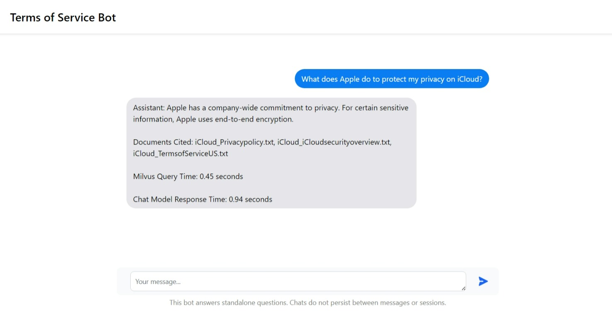

# Milvus RAG Web App

A Retrieval-Augmented-Generation chatbot that draws upon the TOSDR (Terms of Service Didn't Read) corpus to answer your questions about online privacy and more

You can send individual questions to the model [here](http://ijyliu.github.io/milvus-rag-web-app-loading-page/loading.html).

To construct this app, each sentence in the TOSDR corpus (with the company name inserted) was converted to an embedding using Mixedbread.ai's state-of-the-art embedding model, and loaded into Milvus with a Euclidean IVF Flat index (L2 distance, clustered nearest neighbor search). When the user asks a question it is encoded with the model, and the top 5 most similar vectors are fetched from Milvus. The sentences for these vectors are appended to the prompt context for a deployed version of Google Gemma, which draws upon the information to answer the user's query.

## Technologies (not exhaustive!)

- Milvus Vector DB through Zilliz Cloud
- Python
  - PyMilvus SDK
  - Flask
- Ollama
- Docker
- Google Cloud Platform

## Acknowledgements

Based on [data engineering work](https://github.com/ijyliu/data-engineering-project) completed with Fangyuan Li and Robert Thompson

Frontend design inspired by: [Gravtas-J/Ollama-Chat](https://github.com/Gravtas-J/Ollama-Chat)
